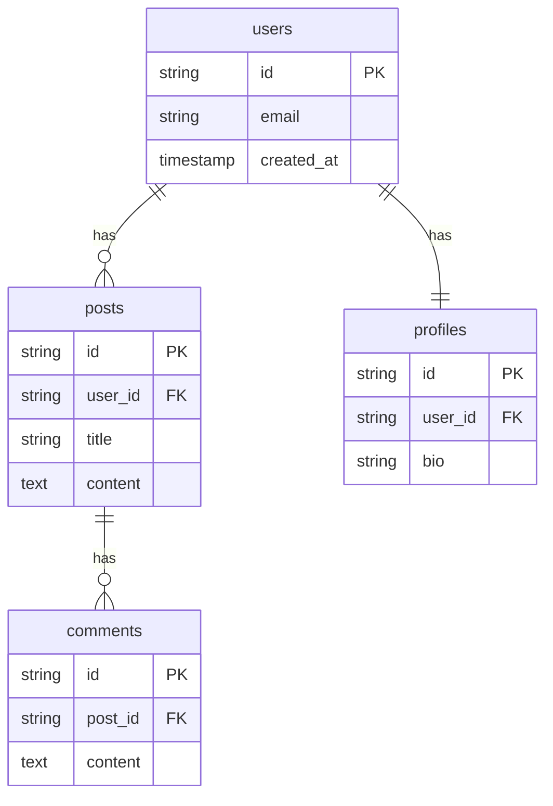

# Design: ER 다이어그램

## 아키텍처

```
┌─────────────────────────────────────────────────────────┐
│               UnifiedSchema (v0.5.0)                    │
│         tables[], relations[], enums[]                  │
└──────────────────────┬──────────────────────────────────┘
                       │
          ┌────────────▼────────────┐
          │    ER Diagram Generator │
          │    (lib/schema/er.mjs)  │
          └────────────┬────────────┘
                       │
          ┌────────────▼────────────┐
          │    Mermaid erDiagram    │
          │    Code Output          │
          └────────────┬────────────┘
                       │
       ┌───────────────┼───────────────┐
       ▼               ▼               ▼
┌───────────┐   ┌───────────┐   ┌───────────┐
│  stdout   │   │ overview  │   │   JSON    │
│  출력     │   │   .md     │   │   출력    │
└───────────┘   └───────────┘   └───────────┘
```

## Mermaid erDiagram 문법

### 관계 표현

```
erDiagram
    ENTITY1 ||--o{ ENTITY2 : relationship_name
```

| 기호 | 의미 |
|------|------|
| `\|\|` | 정확히 1개 |
| `o\|` | 0 또는 1개 |
| `}o` | 0개 이상 |
| `}\|` | 1개 이상 |

### 관계 유형 매핑

```typescript
function relationToMermaid(relation: Relation): string {
  const symbols = {
    '1:1': '||--||',
    '1:N': '||--o{',
    'N:1': '}o--||',
    'N:M': '}o--o{'
  };

  return `${relation.fromTable} ${symbols[relation.type]} ${relation.toTable} : "${relation.name || ''}"`;
}
```

## 출력 예시

### 입력 (UnifiedSchema)

```typescript
{
  tables: [
    { name: 'users', columns: [...] },
    { name: 'posts', columns: [...] },
    { name: 'comments', columns: [...] },
    { name: 'profiles', columns: [...] }
  ],
  relations: [
    { type: '1:N', fromTable: 'users', toTable: 'posts', name: 'has' },
    { type: '1:1', fromTable: 'users', toTable: 'profiles', name: 'has' },
    { type: '1:N', fromTable: 'posts', toTable: 'comments', name: 'has' }
  ]
}
```

### 출력 (Mermaid)



## CLI 인터페이스

```bash
# 다이어그램만 출력
zywiki schema --diagram

# 다이어그램 + 전체 문서
zywiki schema --diagram --output zywiki/database/

# JSON에 다이어그램 포함
zywiki schema --json --diagram
```

## 데이터 스키마

### DiagramOptions

```typescript
interface DiagramOptions {
  includeColumns?: boolean;   // 테이블 내 컬럼 표시 (기본: true)
  includeTypes?: boolean;     // 컬럼 타입 표시 (기본: true)
  includePK?: boolean;        // PK 표시 (기본: true)
  includeFK?: boolean;        // FK 표시 (기본: true)
}
```

### DiagramOutput (JSON 출력 시)

```typescript
interface SchemaOutput {
  // 기존 v0.5.0 필드
  tables: Table[];
  meta: { dialect: string; tableCount: number };

  // v0.7.0 추가
  diagram?: {
    mermaid: string;          // Mermaid 코드
    relationCount: number;    // 관계 수
  };
}
```

## 구현

### ER Generator

```typescript
// lib/schema/er.mjs
export function generateErDiagram(
  schema: UnifiedSchema,
  options: DiagramOptions = {}
): string {
  const {
    includeColumns = true,
    includeTypes = true,
    includePK = true,
    includeFK = true
  } = options;

  let diagram = 'erDiagram\n';

  // 1. 관계 추가
  for (const relation of schema.relations) {
    diagram += `    ${relationToMermaid(relation)}\n`;
  }

  diagram += '\n';

  // 2. 테이블 정의 추가
  if (includeColumns) {
    for (const table of schema.tables) {
      diagram += `    ${table.name} {\n`;
      for (const col of table.columns) {
        const type = includeTypes ? col.type.toLowerCase() : '';
        const pk = includePK && col.primaryKey ? 'PK' : '';
        const fk = includeFK && col.references ? 'FK' : '';
        const attrs = [pk, fk].filter(Boolean).join(',');
        diagram += `        ${type} ${col.name}${attrs ? ' ' + attrs : ''}\n`;
      }
      diagram += `    }\n\n`;
    }
  }

  return diagram.trim();
}
```

### 마크다운 통합

```typescript
// zywiki/database/overview.md 생성
function generateOverviewMd(schema: UnifiedSchema): string {
  const diagram = generateErDiagram(schema);

  return `# Database Schema Overview

## ER Diagram

\`\`\`mermaid
${diagram}
\`\`\`

## Tables

| Table | Columns | Relations |
|-------|---------|-----------|
${schema.tables.map(t =>
  `| ${t.name} | ${t.columns.length} | ${countRelations(t, schema)} |`
).join('\n')}
`;
}
```

## 파일 구조

```
lib/
├── schema/
│   ├── er.mjs            # ER 다이어그램 생성기 (신규)
│   ├── renderer.mjs      # 기존 + overview.md 생성 추가
│   └── ...
└── commands/
    └── schema.mjs        # --diagram 옵션 추가
```
