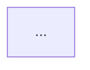

# Design: zywiki

## Architecture Overview

```
┌─────────────────────────────────────────────────────────────┐
│                      zywiki CLI                              │
├─────────────────────────────────────────────────────────────┤
│  Commands                                                    │
│  ┌──────┐ ┌─────┐ ┌───────┐ ┌────────┐ ┌────────┐ ┌──────┐ │
│  │ init │ │ add │ │ build │ │generate│ │ detect │ │ sync │ │
│  └──┬───┘ └──┬──┘ └───┬───┘ └───┬────┘ └───┬────┘ └──┬───┘ │
│     │        │        │         │          │         │      │
│  ┌──▼────────▼────────▼─────────▼──────────▼─────────▼────┐ │
│  │                    Core Engine                          │ │
│  │  ┌────────────┐ ┌────────────┐ ┌───────────────────┐   │ │
│  │  │  Metadata  │ │   Parser   │ │   AI Generator    │   │ │
│  │  │  Manager   │ │  & Grouper │ │                   │   │ │
│  │  └────────────┘ └────────────┘ └───────────────────┘   │ │
│  └────────────────────────────────────────────────────────┘ │
├─────────────────────────────────────────────────────────────┤
│  AI Providers                                                │
│  ┌──────────────┐ ┌──────────────┐                         │
│  │ Gemini API   │ │ Claude Code  │                         │
│  │ (gemini.mjs) │ │ (claude.mjs) │                         │
│  └──────────────┘ └──────────────┘                         │
├─────────────────────────────────────────────────────────────┤
│  Integrations                                                │
│  ┌──────────────┐ ┌──────────────┐                         │
│  │ Claude Code  │ │    Git       │                         │
│  │   Hooks      │ │   Hooks      │                         │
│  └──────────────┘ └──────────────┘                         │
└─────────────────────────────────────────────────────────────┘
```

## Directory Structure (생성되는 구조)

```
project-root/
├── .zywiki/
│   ├── config.json          # 설정 파일
│   └── metadata.json        # 코드-문서 매핑
├── zywiki/                   # 기본 문서 디렉토리
│   ├── architecture/        # 아키텍처 문서
│   ├── features/            # 기능별 문서
│   ├── api/                 # API 참조
│   ├── database/            # 데이터베이스 문서
│   ├── guides/              # 가이드 문서
│   └── index.md             # 문서 인덱스
└── .claude/                 # (선택) Claude Code 훅 설정
    └── settings.local.json
```

## Package Structure (npm 패키지)

```
zywiki/
├── package.json
├── README.md
├── LICENSE                  # MIT
├── bin/
│   └── zywiki.mjs          # CLI 진입점
├── src/
│   ├── index.mjs            # 메인 모듈
│   ├── commands/
│   │   ├── init.mjs         # 프로젝트 초기화
│   │   ├── add.mjs          # 파일 추적 등록
│   │   ├── build.mjs        # AI 문서 생성
│   │   ├── generate.mjs     # 개별 파일 문서 생성
│   │   ├── detect.mjs       # 변경 감지
│   │   ├── status.mjs       # 상태 확인
│   │   └── sync.mjs         # 동기화 프롬프트
│   ├── core/
│   │   ├── metadata.mjs     # 메타데이터 관리
│   │   ├── parser.mjs       # 코드 파싱
│   │   ├── grouper.mjs      # 파일 그룹핑
│   │   ├── detector.mjs     # 변경 감지
│   │   ├── ai-generator.mjs # AI 프롬프트 생성
│   │   ├── gemini.mjs       # Gemini API 클라이언트
│   │   ├── prompt.mjs       # 대화형 프롬프트
│   │   └── progress.mjs     # 진행률 표시
│   └── integrations/
│       ├── claude-code.mjs  # Claude Code 훅 설정
│       └── git.mjs          # Git 통합
└── templates/
    └── ...                  # 문서 템플릿
```

## Core Schemas

### Config Schema (.zywiki/config.json)

```json
{
  "version": "1.0.0",
  "docsDir": "zywiki",
  "language": "ko",
  "ai": {
    "provider": "gemini",
    "model": "gemini-2.5-flash",
    "apiKey": null
  },
  "sourcePatterns": ["src/**/*.{ts,tsx,js,jsx}"],
  "ignorePatterns": ["**/*.test.ts", "**/node_modules/**"],
  "integrations": {
    "claudeCode": false,
    "git": false
  }
}
```

### Metadata Schema (.zywiki/metadata.json)

```json
{
  "version": "1.0.0",
  "lastUpdated": "2025-01-15T10:00:00Z",
  "snippets": [
    {
      "id": "unique-id",
      "path": "src/lib/service.ts",
      "lines": 150,
      "hash": "sha256:abc123...",
      "category": "features",
      "docs": ["zywiki/features/service.md"],
      "updatedAt": "2025-01-15T10:00:00Z"
    }
  ],
  "documents": [
    {
      "path": "zywiki/features/service.md",
      "references": ["src/lib/service.ts"],
      "updatedAt": "2025-01-15T10:00:00Z"
    }
  ]
}
```

## CLI Commands

| 명령어 | 설명 | 옵션 |
|--------|------|------|
| `zywiki init` | 프로젝트 초기화 | `--claude`, `--git`, `--force`, `--docs-dir` |
| `zywiki add <path>` | 파일 추적 등록 | `-r`/`--recursive`, `--category` |
| `zywiki build` | AI 문서 생성 | `--prompt`, `--force`, `--filter`, `--lang` |
| `zywiki generate <path>` | 개별 파일 문서 생성 | `--category`, `--title` |
| `zywiki detect` | 변경 감지 | `--output`, `--quiet` |
| `zywiki status` | 상태 확인 | - |
| `zywiki sync` | 동기화 프롬프트 생성 | `--format`, `--clear` |

## AI Providers

### Gemini API (Recommended - Free)

```javascript
const GEMINI_API_URL = 'https://generativelanguage.googleapis.com/v1beta/models';

// Rate limits: 15 requests per minute
// Built-in: 6.5s delay between requests
// Model: gemini-2.5-flash (fast, free)
```

### Claude Code CLI

```javascript
// Uses Claude CLI with Haiku model (fast & cheap)
spawn('claude', ['-p', prompt, '--model', 'haiku', '--output-format', 'json']);
```

## Document Generation Format

생성되는 문서 형식:

```markdown
<cite>src/path/to/file.ts</cite>

### 개요
[2-3문장 설명]

### 아키텍처 다이어그램


### 주요 함수/클래스
- `functionName` - 설명
- `ClassName` - 설명

### 설정/사용법
[코드 예시 1-2개]

### 문제 해결 가이드
1. 문제 1 - 해결책
2. 문제 2 - 해결책
```

## Supported Languages

1. English (en)
2. Español (es)
3. Français (fr)
4. 日本語 (ja)
5. 한국어 (ko)
6. Português (pt-br)
7. Русский (ru)
8. Tiếng Việt (vi)
9. 简体中文 (zh)
10. 繁體中文 (zh-tw)

## Technology Choices

| 선택 | 이유 |
|------|------|
| ESM (`.mjs`) | 최신 Node.js 표준, 트리쉐이킹 지원 |
| Commander.js | CLI 파싱 표준, 유일한 외부 의존성 |
| Gemini API | 무료, 빠름, 충분한 품질 |
| Node.js 18+ | ESM 네이티브 지원 |
